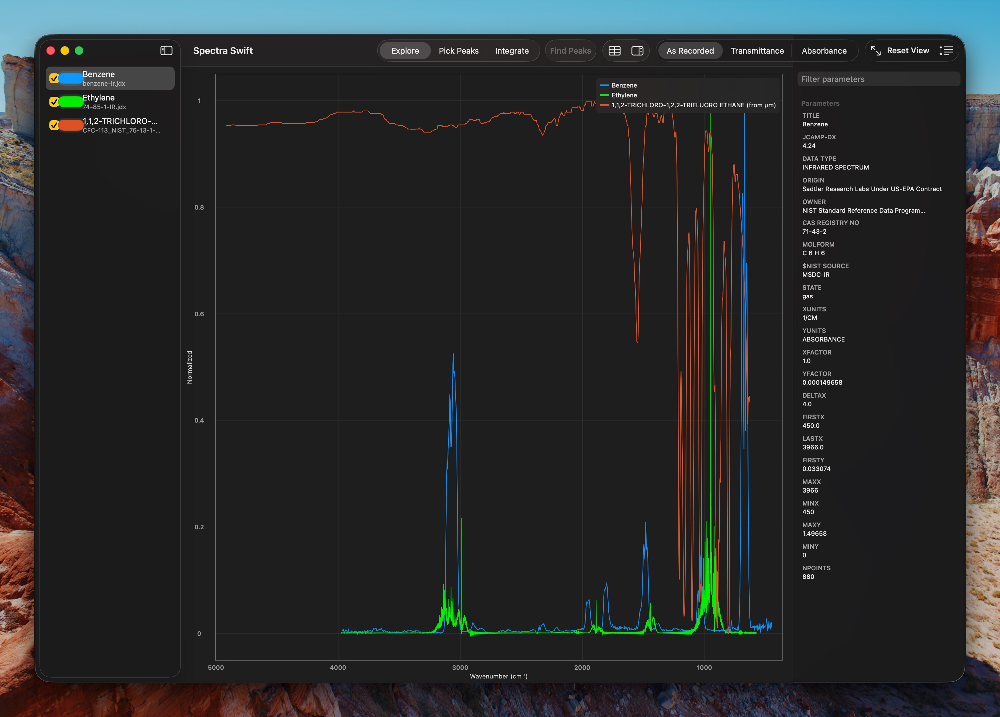
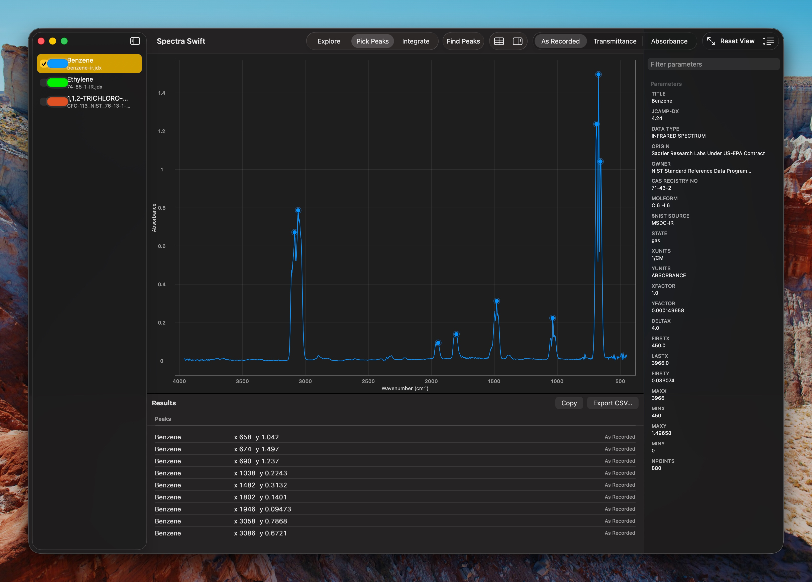
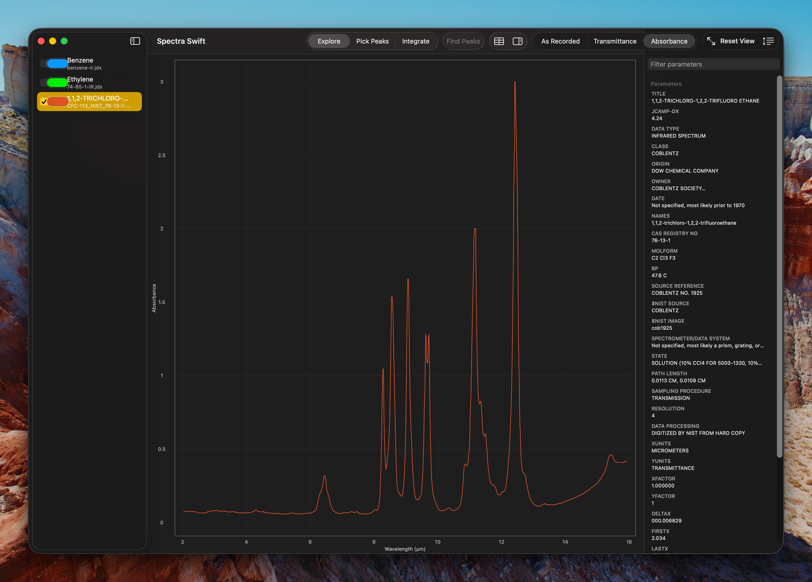

# Spectra Swift

A native macOS viewer for spectroscopy files: JCAMP-DX, the format the
NIST WebBook serves for IR, mass, and UV-Vis spectra, and Bruker OPUS
files straight from the spectrometer. Built with Swift and SwiftUI.

Drop a `.jdx`, `.dx`, or OPUS `.0` file onto the window (or double-click
it in Finder) and you get an interactive plot that follows the
conventions chemists expect: IR spectra draw with the wavenumber axis
running high to low, mass spectra draw as stick plots, and a toolbar
toggle converts IR data between transmittance and absorbance on the fly.

## Screenshots

Three NIST gas-phase IR spectra overlaid on a normalized axis:



Peak picking on benzene, with the picked peaks marked on the plot and
listed in the results table below:



A Coblentz Society spectrum shown on its native wavelength axis, with
every parameter from the file in the searchable inspector:



## Features

- **Overlay and compare** - Load any number of spectra; checkboxes in the
  sidebar control which ones draw together. Spectra with different y-units
  overlay on a normalized axis.
- **Navigate** - Rubber-band box zoom, scroll-wheel and pinch zoom about
  the cursor, Option-drag to pan, double-click or ⌘0 to reset.
- **Read values** - A crosshair snaps to the nearest data point on any
  visible trace and shows its exact coordinates.
- **Measure** - Pick peaks by hand or detect them automatically, measure
  baseline-referenced peak heights, and integrate the area between two
  points. Results land in a table you can copy into Excel or export as CSV.
- **Label peaks** - Picked peaks are labeled on the plot, and you can
  rename any label in the results table ("C-H stretch" beats "3086.2").
  Labels carry into exported images and the peak table.
- **Smooth** - A Savitzky-Golay filter with a live preview cleans up noisy
  instrument data. The result appears as a new spectrum; the original
  data is never touched.
- **Open instrument files** - Bruker OPUS files (`.0`, `.1`, ...) open
  directly, including the processed spectrum and instrument metadata.
- **Difference spectra** - Subtract one spectrum from another to spot
  what changed.
- **Sessions** - Save your whole workspace (files, colors, measurements,
  view) as a `.spectrasession` file and pick up where you left off.
- **Inspect metadata** - Every parameter recorded in the file, in a
  searchable panel, along with any warnings from parsing.
- **Export** - CSV or JCAMP-DX for the data; PNG or vector PDF for the
  plot; ⇧⌘C copies the plot straight to the clipboard.

## Requirements

- macOS 14.0 (Sonoma) or later

## Installing

1. Download `SpectraSwift-<version>.zip` from the
   [latest release](https://github.com/proverbiallemon/SpectraSwift/releases/latest)
2. Unzip it and drag `Spectra.app` into your Applications folder
3. **First launch**: see [Bypassing Gatekeeper](#bypassing-gatekeeper) below

After that the app keeps itself current: it checks for updates once a
day, and you can check any time with **Spectra Swift ▸ Check for
Updates**. Updates install and relaunch in place, with no Gatekeeper
dance the second time around.

One quirk worth knowing: OPUS files use bare numeric extensions (`.0`,
`.1`), which other apps sometimes claim. If double-clicking one doesn't
open Spectra Swift, right-click it and choose **Open With** once.

> **Note**: Spectra Swift isn't signed with an Apple Developer certificate,
> so macOS will block it on first launch. This is normal for open-source
> apps distributed outside the App Store.

### Bypassing Gatekeeper

**macOS Sequoia (15.0) and later**

1. Double-click `Spectra.app` and you'll see **"Spectra" Not Opened**
2. Click **Done** (not "Move to Trash")
3. Open **System Settings** → **Privacy & Security**
4. Scroll down to **Security** and find "Spectra was blocked to protect your Mac"
5. Click **Open Anyway**, then confirm with **Open Anyway** again

**macOS Sonoma (14.x)**

1. Right-click `Spectra.app` and select **Open**
2. Click **Open** in the dialog that appears

**Terminal alternative** (any version):

```sh
xattr -cr /Applications/Spectra.app
```

> **Why does this happen?** Apple requires a $99/year Developer Program
> membership to sign apps. The app is safe: you can verify by
> [building from source](#building) or reviewing the code right here.

## Known issues

- Dragging the sidebar divider to the right can leave the spectra list
  looking blank. Nothing is lost; toggle the sidebar closed and open
  again (View ▸ Hide/Show Sidebar, ⌃⌘S) and it comes back. ([#1](https://github.com/proverbiallemon/SpectraSwift/issues/1))
- The sidebar occasionally starts hidden after a restart; the same
  shortcut brings it in. ([#2](https://github.com/proverbiallemon/SpectraSwift/issues/2))
- Files opened while the app is closed occasionally don't load; open the
  file again once the app is running. ([#3](https://github.com/proverbiallemon/SpectraSwift/issues/3))
- Measuring is deliberately disabled while a spectrum is displayed
  unit-converted or on a mixed-unit normalized overlay. Show the spectrum
  by itself to measure it in its native units.

## Format support

The parser handles the JCAMP-DX 4.24/5.00 features found in real-world
files: `(X++(Y..Y))` data with the full ASDF compression set (PAC, SQZ,
DIF, DUP), peak tables, NTUPLES data tables, compound multi-spectrum
files, and both line-abscissa conventions in circulation (including the
one NIST's quantitative IR database uses). Malformed files degrade
gracefully: recoverable oddities load with a warning badge instead of
failing, and unreadable files produce a clear error naming the reason.

Bruker OPUS binary files import their processed result spectrum
(absorbance or transmittance, detected from the file), the x grid, and
every instrument, sample, and acquisition parameter for the inspector.
Interferograms and raw single-channel data are skipped; a file holding
only those says so instead of guessing. The reader was validated against
reference implementations and tested on files straight off a working
spectrometer.

Parsing lives in `SpectraKit`, a UI-free Swift package, and is tested
against fixtures downloaded from NIST as well as synthetic edge cases.

## Building

Requires macOS 14+, Xcode 16 or later, and [XcodeGen](https://github.com/yonaskolb/XcodeGen).

```sh
xcodegen generate
xcodebuild -project Spectra.xcodeproj -scheme Spectra -configuration Debug build
```

Or open the generated `Spectra.xcodeproj` in Xcode and run.

To run the library tests:

```sh
swift test
```

## Layout

```
Sources/SpectraKit/   file parsing and the spectrum model (no UI)
Tests/                Swift Testing suite + NIST fixture files
App/                  the SwiftUI app
project.yml           XcodeGen project definition
```

## Planned

Normalizing spectra to a reference peak, full baseline correction, and
eventually spectral library search. Ideas and bug reports welcome in the
[issues](https://github.com/proverbiallemon/SpectraSwift/issues).

## License

MIT License - see [LICENSE](LICENSE)
