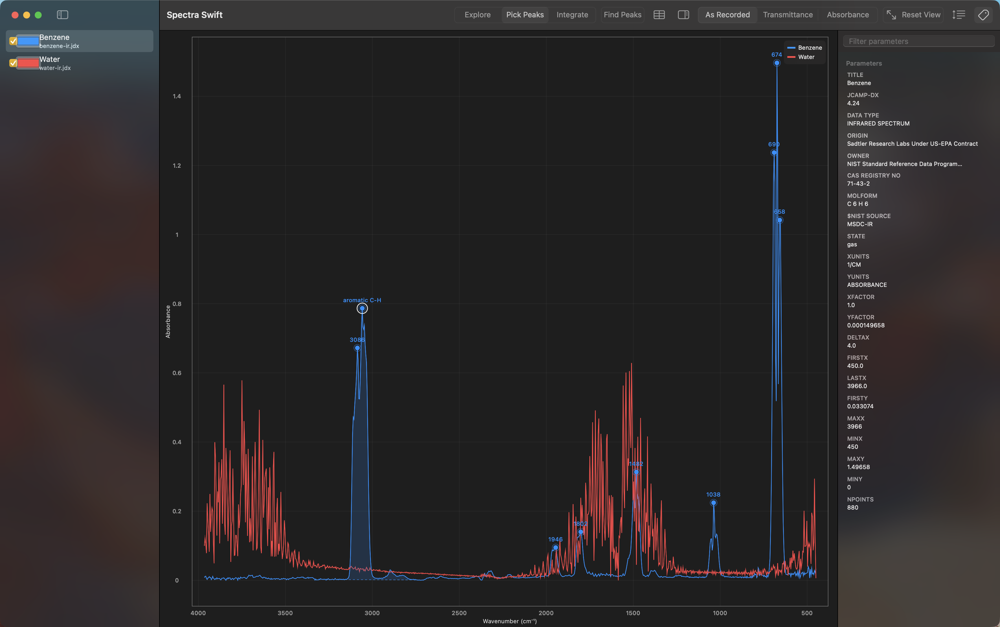

# Spectra Swift

Spectra Swift is a native Mac app for viewing spectroscopy files: JCAMP-DX,
the format the NIST WebBook serves for infrared, mass, and UV-Vis spectra,
and Bruker OPUS files straight off a spectrometer. Drop a file onto the
window and you get an interactive plot with the conventions chemists
expect: infrared spectra draw with the wavenumber axis running high to
low, mass spectra draw as stick plots, and a toolbar toggle converts
infrared data between transmittance and absorbance on the fly. Pick peaks
by hand or automatically, measure heights and integrate areas, and export
the data, the plot, or your measurements to take elsewhere.

[Download the latest release](https://github.com/proverbiallemon/SpectraSwift/releases/latest)

New to Spectra Swift? Start with [Getting Started](Getting-Started).

Next: [Getting Started](Getting-Started)
