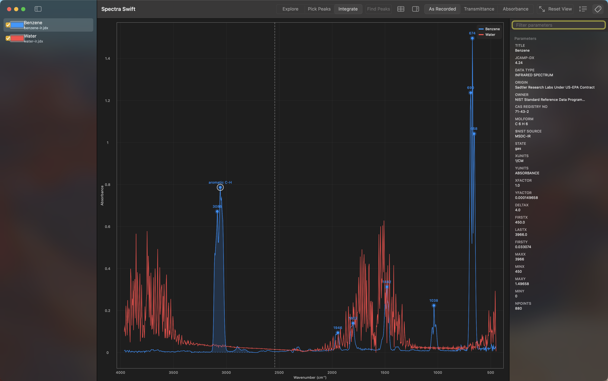
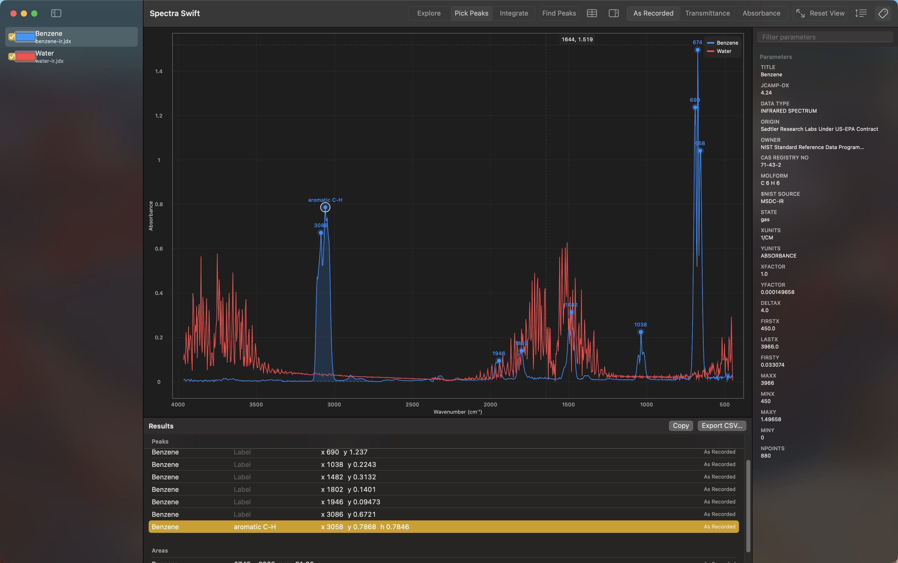

# Measuring

Pick Peaks and Integrate, the plot's other two modes (see
[Reading the Plot](Reading-the-Plot) for the mode picker), turn a click
into a measurement against one spectrum: the one selected in the sidebar,
if it's visible, or the only visible spectrum if none is selected. If
neither applies, a click just beeps with "Select a spectrum to measure."

## Pick Peaks

Click near a peak and it snaps to the nearest apex on the target
spectrum, adding a mark there. Click somewhere with no peak nearby and
you get a beep and "No peak near that position" instead.

In Transmittance display, peaks point down. Transmittance measures how
much light gets through the sample, and it drops where the sample
absorbs, so an absorption band shows up as a dip rather than a bump.
Pick Peaks (and Find Peaks, below) look for minima instead of maxima
whenever the plot is showing Transmittance.

Clicking the same spot twice, for the same spectrum, x position, and
display mode, is silently ignored rather than adding a duplicate mark.
New peaks you pick by hand are added to the end of the results table.

## Find Peaks

The Find Peaks toolbar button is enabled only in Pick Peaks mode. It
scans the whole visible curve of the target spectrum and adds every peak
it finds at once. If it doesn't find any, the status message reads
"No peaks found."

## Peak heights (the h column)

A peak gets a height value only when it was picked by hand, inside an
existing integration region, on the same spectrum and the same display
mode. The baseline for that height is a straight line (a chord) between
the region's two endpoints, not zero, so the h value is how far the peak
rises above that line. Peaks found with Find Peaks never get a height,
even when they land inside a region: heights are a manual-pick feature.
If you want a peak's height, integrate the region first, then pick the
peak by hand inside it.

## Integrate

Integrate mode uses two plain clicks and no modifier key at all; there's
no shift-click mechanic despite what you might have heard.

1. The first click sets the start of the region and drops a dashed
   vertical guide line at that x position.

   

2. The second click closes the region between the two x positions, adds
   it to the results table, and shades the area under the curve.

Escape does not cancel a pending click. If you start a region and change
your mind, switch to a different mode (Explore or Pick Peaks), which
clears the pending click, or place the second click to finish the region
and delete it afterward from the results table. See
[Tips and Shortcuts](Tips-and-Shortcuts) for more on this and the
shift-click rumor.

If the second click lands somewhere with no data between the two points,
you get a beep and "That range contains no data to integrate," and no
region is added.

## The results table

Show or hide it with the Results toolbar button or Shift-Command-T; it
opens on its own the first time you add a measurement.

- **Peaks** list the spectrum, an editable label, x, y, an h value when
  one applies, and the display mode the peak was measured in. Click a
  row to select it, then edit the label field directly; clearing it
  reverts to the default name (the x value).
- **Areas** list the spectrum, the x1-x2 range, the area, and the display
  mode.
- Selecting rows highlights the matching marks on the plot; you can
  select more than one at a time.
- **Copy** puts a tab-separated copy of the current selection (or
  everything, if nothing's selected) on the clipboard, ready to paste
  into a spreadsheet.
- **Export CSV…** writes the same data to a CSV file you choose.
- The Delete key, or Delete from a row's context menu, removes the
  selected rows.

For the full keyboard shortcut list, see
[Tips and Shortcuts](Tips-and-Shortcuts).

## Why measuring gets refused

Two situations turn off clicking to measure entirely. Both show a status
message at the bottom of the plot for a couple of seconds, along with a
beep:

- A message saying mixed y-units are normalized for display, and to view
  the spectrum alone to measure. This appears when you're overlaying
  spectra with different y-units, since the plot rescales each one to a
  0-1 range so they fit together, and a position on that rescaled axis
  doesn't correspond to a real measurement anymore.
- A message saying the spectrum is shown unit-converted, and to view it
  alone to measure in its native units. This appears on a wavelength
  spectrum that's currently displayed converted to wavenumber because it
  shares the plot with a wavenumber spectrum; a click there would land at
  the wrong x in the file's actual recorded units.

The fix for both is the same: uncheck the other spectra in the sidebar so
only the one you want to measure is visible, and measure it there.

## Marks are scoped to the display mode

Peaks and integration regions remember which Y Display mode they were
measured in (As Recorded, Transmittance, or Absorbance) and only draw
while the plot is showing that same mode. Switch Y Display and a
spectrum's earlier marks disappear until you switch back. They aren't
deleted, just hidden.

Next: [Smoothing and Derived Spectra](Smoothing-and-Derived-Spectra)
