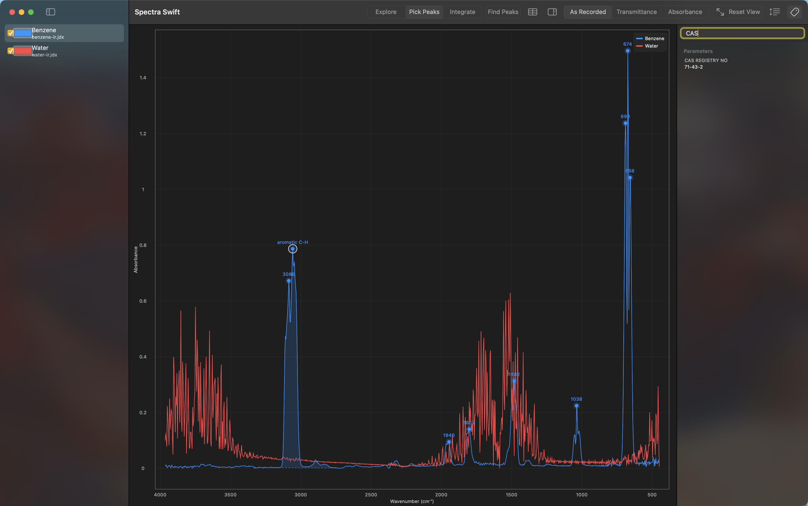

# Opening Files

## Ways to open a file

- **File > Open (Command-O)** opens a file picker limited to the formats
  Spectra Swift understands. You can select more than one file at a time.
- **Drag and drop** anywhere on the window. This works for spectrum files
  and `.spectrasession` files together, in one drop.
- **Finder double-click** opens the file directly, with one quirk: OPUS
  files use bare numeric extensions (`.0`, `.1`, and so on), which another
  app on your Mac may already claim. If double-clicking one opens
  something else, right-click it, choose Open With, and pick Spectra
  Swift once. Finder remembers your choice after that. File > Open and
  drag-drop both work regardless of which app owns the extension. See
  [Troubleshooting](Troubleshooting) if this happens to you.

## What Spectra Swift reads

- **JCAMP-DX** (`.jdx`, `.dx`, `.jcm`): the text format most spectroscopy
  software, including the NIST WebBook, exports.
- **Bruker OPUS** (`.0` through `.9`): the binary format written directly
  by Bruker spectrometers. OPUS files are identified by their contents,
  not their extension, so a renamed or oddly-numbered file still opens
  correctly.
- **Sessions** (`.spectrasession`): your whole workspace, saved with
  File > Save Session (Command-S). Opening one restores every spectrum,
  its color and visibility, your peaks and integration regions, the view,
  and the Y Display setting, all at once.

For the full list of what each format supports, what OPUS skips, and how
malformed files are handled, see [Format Support](Format-Support).

## Warnings on a loaded spectrum

If a file loads with something recoverable but worth knowing about, a
small warning badge appears next to its name in the sidebar. Hover over
the badge to see every warning for that spectrum in a tooltip. The same
warnings, with the rest of the file's metadata, are listed in the
inspector, where a filter box narrows a long parameter list down to what
you're looking for. The filter matches parameter values as well as their
names, so searching "CAS" finds a parameter named `CAS registry no.` and
any other parameter whose value happens to contain "CAS."

## When a file won't load

If a file can't be read at all, an alert names the file and the specific
reason: an unrecognized format, a JCAMP record that doesn't parse, or an
OPUS file with no spectrum data. If you tried to open several files at
once and more than one failed, the alert lists all of them together.

Next: [Reading the Plot](Reading-the-Plot)
