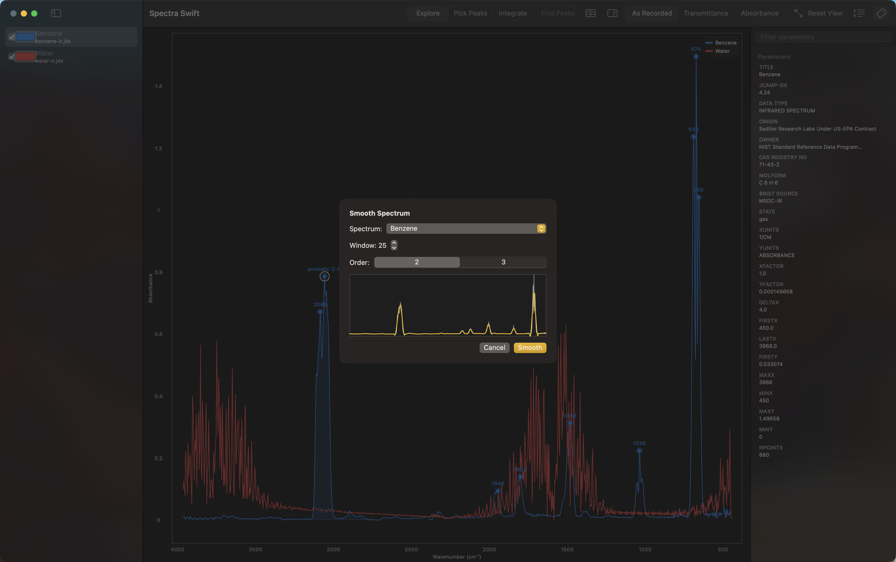

# Smoothing and Derived Spectra

## Smooth

Spectra ▸ Smooth… opens a sheet (needs at least one spectrum loaded).
Pick a spectrum, a window size (an odd number from 5 to 25, in steps of
2, default 11), and a polynomial order (2 or 3, default 2). A live
preview redraws as you adjust either setting, with the raw data in gray
and the smoothed curve in the accent color.

This is a Savitzky-Golay filter: it fits a small polynomial to a moving
window of points and replaces the point at the center with the
polynomial's value there. That smooths out noise while preserving peak
shape better than a simple moving average would.

Two situations refuse to smooth:

- A spectrum with fewer points than the chosen window: "This spectrum
  has N points, but a window of W needs at least that many."
- Stick data, like a mass spectrum: "Stick spectra (like mass spectra)
  can't be smoothed."

Clicking Smooth adds a new spectrum to the sidebar named
"<original name> (smoothed)." The original spectrum is left exactly as
it was. The new spectrum's inspector carries one extra parameter,
SMOOTHING, recording what was used, for example "Savitzky-Golay, window
25, order 2."

## Subtract

Spectra ▸ Subtract… opens a sheet (needs at least two spectra loaded).
Pick spectrum A and spectrum B; the result is A minus B, with B
interpolated onto A's x grid over the range where they overlap. The
result's title joins both spectrum names with a minus sign, like
"Sample − Background."

Subtract refuses outright in two cases:

- Different x-axis units: "These spectra use different x-axis units, so
  subtracting them isn't meaningful."
- No overlap at all on the x-axis: "These spectra don't overlap on the
  x-axis, so there's nothing to subtract."

If the two spectra only overlap partially, or their y-units don't match,
Subtract still succeeds, but the result carries a warning explaining
what happened (visible the same way as any other spectrum warning: the
sidebar badge and the inspector).

## Derived spectra

Both Smooth and Subtract add a new entry to the sidebar rather than
changing anything about the spectra you started with. A derived spectrum
gets its own color and can be toggled, selected, or removed like any
other. Since it didn't come from a file, its sidebar entry has no
filename underneath its title.

Next: [Exporting](Exporting)
